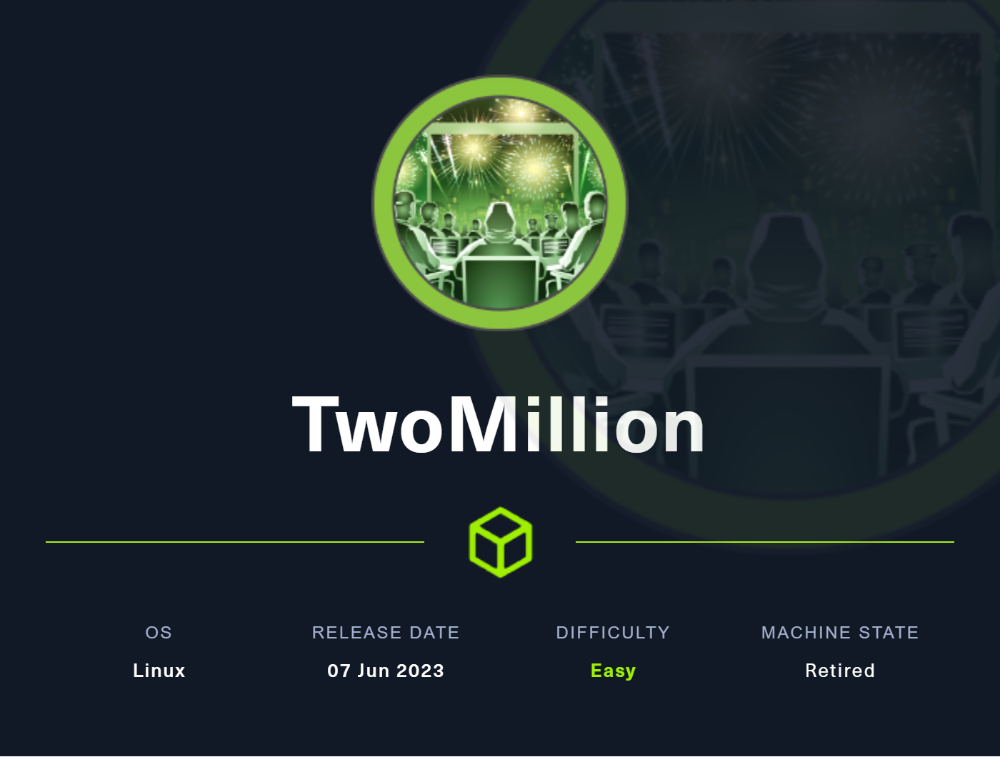

# HTB - TwoMillion


<figure><figcaption></figcaption></figure>

## Overview

This box is quite a straightforward box. The foothold was the most interesting part with the command injection being easily missable. The root was a very simple kernel exploit.

## User

Firstly we run an Nmap scan;  `sudo nmap -p- -sC -sV -sS $ip`. -p- is for all ports, -sC is for scripts and -sV is for enumerating versions.

<figure><figcaption></figcaption></figure>

The typical two ports are open, 22 and 80. I see that it redirects to a domain (2million.htb) as per HTB fashion, I add this to my host's file.

<figure><figcaption></figcaption></figure>

Checking out the page, it's an old version of hackthebox. I move to the login page and try to interact with the application but we do not have an account. I attempt to register at /register but it says I need an invite code.

<figure><figcaption></figcaption></figure>

### Gobuster

So we know we need an invite code to move forward. I run a gobuster to enumerate pages and directories, I use a wordlist that's what I normally use from seclists and a -b 301 because the status code 301 was causing issues and I increased the threads to 100 as it was relatively slow if I dont.

<figure><figcaption></figcaption></figure>

There are a few pages but the only ones that seem of interest are api and invite. Since we need an invite code I investigate the invite page but it prompts for an invite code.

<figure><figcaption></figcaption></figure>

I inspect further and find a javascript script being used called inviteapi.min.js.

I try to read it however it is obfuscated, after pasting it in js-beautify, we can read it.\


<figure><figcaption></figcaption></figure>

Theres two main functions where the first verifies the invite code and the second function which seems to allow us to make our own invite code by sending a POST request a to /api/v1/invite/how/to/generate

<figure><figcaption></figcaption></figure>

### Invite Code

After sending a post request to /api/v1/invite/how/to/generate we get an encoded response thats in ROT13, we decode it using cyberchef and get the following:

"In order to generate the invite code, make a POST request to /api/v1/invite/generate"

I send a request to /api/v1/invite/generate and its another encoded string, that looks like base64:

"data":{"code":"QU1NRFgtMThNT04tMTVDOEQtMVg0VDA=","format":"encoded"}

Decoding it in cyberchef we get the invite code: AMMDX-18MON-15C8D-1X4T0

With this we can create an account on the website.

<figure><figcaption></figcaption></figure>

Now that we have an account I look around and nothing seems like a vector except for the access page which has working buttons. Capturing the requests of the generate vpn pack shows that it sends a request to an api endpoint which we had found in gobuster.

The connection pack button sends a GET request to api/v1/user/vpn/generate

We should enumerate this api endpoint and try to find some leads.

Having a look at the base /api/ it says /api/v1.

<figure><figcaption></figcaption></figure>

### API

So I next navigate to /api/v1/ and we get a list of all the endpoints,

<figure><figcaption></figcaption></figure>

The one I believe we are looking for is the /api/v1/admin/settings/update

I send a PUT request to the endpoint in burpsuite and change our user to admin, setting our email as the email we created the account with and is\_admin as 1. This returns a 200 OK which means we are successful.

<figure><figcaption></figcaption></figure>

Going back to our home page and logging back in, nothing has seemed to change. There isnt any admin panel either. I look back into the API endpoints we had found and look at the other admin ones, theres an endpoint to generate a vpn pack for the admin under /api/v1/admin/vpn/generate.

Sending a post request to this endpoint with my username set we get a response of a VPN file generated:

<figure><figcaption></figcaption></figure>

### Command Injection

For a while I poke around unsure what to do but then I realised we could probably inject a command as it takes the username as an input and generates a vpn. One thing I thought of is using semicolon to seperate the commands and inject my own after putting the username and before the string ends to ensure the generation doesnt fail and it continues to run the commands before and after my injection. So it would look like this `"username": "test; whoami ;"`

<figure><figcaption></figcaption></figure>

Running ls -la to see all files including hidden ones, a file stands out which is .env, this contains the environment variables and often has credentials. Outputting it, we get some credentials which we can ssh with.&#x20;

<figure><figcaption></figcaption></figure>

### Foothold

<figure><figcaption></figcaption></figure>

Now we have the user admin and have gotten the user flag!.

## Root

The first thing I typically do is run LinPeas.

Something that looks like a vector is the pkexec policy:

<figure><figcaption></figcaption></figure>

I also had a look at the mail and theres a message from "HTB Godfather" to admin.

<div data-full-width="true">

<figure><figcaption></figcaption></figure>

</div>

This suggest that they are vulnerable to a kernel exploit. Searching the kernel version online leads me to a cve-2023-0386 and a POC is available on github. I download it on my local machine and then to the victim machine inside /tmp.

### [CVE-2023-0386](https://github.com/sxlmnwb/CVE-2023-0386)

The exploit requires us to download a few files and a makefile. We also need two terminals for this. So I ssh in another terminal and run the exploit as intended, when I run ./fuse ./ovlcap/lower ./gc it hangs and then I run ./exp in the other and we get a root shell!\


<div data-full-width="true">

<figure><figcaption></figcaption></figure>

</div>

And just like that we get root. I'll grab root.txt.

## thank\_you.json

There's another file in the /root folder, called thank\_you.json:\


<figure><figcaption></figcaption></figure>

```
root@2million:/root# cat thank_you.json
{"encoding": "url", "data": "%7B%22encoding%22:%20%22hex%22,%20%22data%22:%20%227b22656e6372797074696f6e223a2022786f72222c2022656e6372707974696f6e5f6b6579223a20224861636b546865426f78222c2022656e636f64696e67223a2022626173653634222c202264617461223a20224441514347585167424345454c43414549515173534359744168553944776f664c5552765344676461414152446e51634454414746435145423073674230556a4152596e464130494d556745596749584a51514e487a7364466d494345535145454238374267426942685a6f4468595a6441494b4e7830574c526844487a73504144594848547050517a7739484131694268556c424130594d5567504c525a594b513848537a4d614244594744443046426b6430487742694442306b4241455a4e527741596873514c554543434477424144514b4653305046307337446b557743686b7243516f464d306858596749524a41304b424470494679634347546f4b41676b344455553348423036456b4a4c4141414d4d5538524a674952446a41424279344b574334454168393048776f334178786f44777766644141454e4170594b67514742585159436a456345536f4e426b736a41524571414130385151594b4e774246497745636141515644695952525330424857674f42557374427842735a58494f457777476442774e4a30384f4c524d61537a594e4169734246694550424564304941516842437767424345454c45674e497878594b6751474258514b45437344444767554577513653424571436c6771424138434d5135464e67635a50454549425473664353634c4879314245414d31476777734346526f416777484f416b484c52305a5041674d425868494243774c574341414451386e52516f73547830774551595a5051304c495170594b524d47537a49644379594f4653305046776f345342457454776774457841454f676b4a596734574c4545544754734f414445634553635041676430447863744741776754304d2f4f7738414e6763644f6b31444844464944534d5a48576748444267674452636e4331677044304d4f4f68344d4d4141574a51514e48335166445363644857674944515537486751324268636d515263444a6745544a7878594b5138485379634444433444433267414551353041416f734368786d5153594b4e7742464951635a4a41304742544d4e525345414654674e4268387844456c6943686b7243554d474e51734e4b7745646141494d425355644144414b48475242416755775341413043676f78515241415051514a59674d644b524d4e446a424944534d635743734f4452386d4151633347783073515263456442774e4a3038624a773050446a63634444514b57434550467734344241776c4368597242454d6650416b5259676b4e4c51305153794141444446504469454445516f36484555684142556c464130434942464c534755734a304547436a634152534d42484767454651346d45555576436855714242464c4f7735464e67636461436b434344383844536374467a424241415135425241734267777854554d6650416b4c4b5538424a785244445473615253414b4553594751777030474151774731676e42304d6650414557596759574b784d47447a304b435364504569635545515578455574694e68633945304d494f7759524d4159615052554b42446f6252536f4f4469314245414d314741416d5477776742454d644d526f6359676b5a4b684d4b4348514841324941445470424577633148414d744852566f414130506441454c4d5238524f67514853794562525459415743734f445238394268416a4178517851516f464f676354497873646141414e4433514e4579304444693150517a777853415177436c67684441344f4f6873414c685a594f424d4d486a424943695250447941414630736a4455557144673474515149494e7763494d674d524f776b47443351634369554b44434145455564304351736d547738745151594b4d7730584c685a594b513858416a634246534d62485767564377353043776f334151776b424241596441554d4c676f4c5041344e44696449484363625744774f51776737425142735a5849414242454f637874464e67425950416b47537a6f4e48545a504779414145783878476b6c694742417445775a4c497731464e5159554a45454142446f6344437761485767564445736b485259715477776742454d4a4f78304c4a67344b49515151537a734f525345574769305445413433485263724777466b51516f464a78674d4d41705950416b47537a6f4e48545a504879305042686b31484177744156676e42304d4f4941414d4951345561416b434344384e467a464457436b50423073334767416a4778316f41454d634f786f4a4a6b385049415152446e514443793059464330464241353041525a69446873724242415950516f4a4a30384d4a304543427a6847623067344554774a517738784452556e4841786f4268454b494145524e7773645a477470507a774e52516f4f47794d3143773457427831694f78307044413d3d227d%22%7D"}
```

Its a URL encoded string, Decoding this we get a hex string:\


<div data-full-width="true">

<figure><figcaption></figcaption></figure>

</div>

Decoding the Hex data gives us the following:

```
{"encryption": "xor", "encrpytion_key": "HackTheBox", "encoding": "base64", "data": "DAQCGXQgBCEELCAEIQQsSCYtAhU9DwofLURvSDgdaAARDnQcDTAGFCQEB0sgB0UjARYnFA0IMUgEYgIXJQQNHzsdFmICESQEEB87BgBiBhZoDhYZdAIKNx0WLRhDHzsPADYHHTpPQzw9HA1iBhUlBA0YMUgPLRZYKQ8HSzMaBDYGDD0FBkd0HwBiDB0kBAEZNRwAYhsQLUECCDwBADQKFS0PF0s7DkUwChkrCQoFM0hXYgIRJA0KBDpIFycCGToKAgk4DUU3HB06EkJLAAAMMU8RJgIRDjABBy4KWC4EAh90Hwo3AxxoDwwfdAAENApYKgQGBXQYCjEcESoNBksjAREqAA08QQYKNwBFIwEcaAQVDiYRRS0BHWgOBUstBxBsZXIOEwwGdBwNJ08OLRMaSzYNAisBFiEPBEd0IAQhBCwgBCEELEgNIxxYKgQGBXQKECsDDGgUEwQ6SBEqClgqBA8CMQ5FNgcZPEEIBTsfCScLHy1BEAM1GgwsCFRoAgwHOAkHLR0ZPAgMBXhIBCwLWCAADQ8nRQosTx0wEQYZPQ0LIQpYKRMGSzIdCyYOFS0PFwo4SBEtTwgtExAEOgkJYg4WLEETGTsOADEcEScPAgd0DxctGAwgT0M/Ow8ANgcdOk1DHDFIDSMZHWgHDBggDRcnC1gpD0MOOh4MMAAWJQQNH3QfDScdHWgIDQU7HgQ2BhcmQRcDJgETJxxYKQ8HSycDDC4DC2gAEQ50AAosChxmQSYKNwBFIQcZJA0GBTMNRSEAFTgNBh8xDEliChkrCUMGNQsNKwEdaAIMBSUdADAKHGRBAgUwSAA0CgoxQRAAPQQJYgMdKRMNDjBIDSMcWCsODR8mAQc3Gx0sQRcEdBwNJ08bJw0PDjccDDQKWCEPFw44BAwlChYrBEMfPAkRYgkNLQ0QSyAADDFPDiEDEQo6HEUhABUlFA0CIBFLSGUsJ0EGCjcARSMBHGgEFQ4mEUUvChUqBBFLOw5FNgcdaCkCCD88DSctFzBBAAQ5BRAsBgwxTUMfPAkLKU8BJxRDDTsaRSAKESYGQwp0GAQwG1gnB0MfPAEWYgYWKxMGDz0KCSdPEicUEQUxEUtiNhc9E0MIOwYRMAYaPRUKBDobRSoODi1BEAM1GAAmTwwgBEMdMRocYgkZKhMKCHQHA2IADTpBEwc1HAMtHRVoAA0PdAELMR8ROgQHSyEbRTYAWCsODR89BhAjAxQxQQoFOgcTIxsdaAAND3QNEy0DDi1PQzwxSAQwClghDA4OOhsALhZYOBMMHjBICiRPDyAAF0sjDUUqDg4tQQIINwcIMgMROwkGD3QcCiUKDCAEEUd0CQsmTw8tQQYKMw0XLhZYKQ8XAjcBFSMbHWgVCw50Cwo3AQwkBBAYdAUMLgoLPA4NDidIHCcbWDwOQwg7BQBsZXIABBEOcxtFNgBYPAkGSzoNHTZPGyAAEx8xGkliGBAtEwZLIw1FNQYUJEEABDocDCwaHWgVDEskHRYqTwwgBEMJOx0LJg4KIQQQSzsORSEWGi0TEA43HRcrGwFkQQoFJxgMMApYPAkGSzoNHTZPHy0PBhk1HAwtAVgnB0MOIAAMIQ4UaAkCCD8NFzFDWCkPB0s3GgAjGx1oAEMcOxoJJk8PIAQRDnQDCy0YFC0FBA50ARZiDhsrBBAYPQoJJ08MJ0ECBzhGb0g4ETwJQw8xDRUnHAxoBhEKIAERNwsdZGtpPzwNRQoOGyM1Cw4WBx1iOx0pDA=="}
```

Another encoded string, its encoded with base64 then xor with the key has HackTheBox, decoding it gives us a Heartfelt message from the Hackthebox team.

<div data-full-width="true">

<figure><figcaption></figcaption></figure>

</div>

> Dear HackTheBox Community,
>
> We are thrilled to announce a momentous milestone in our journey together. With immense joy and gratitude, we celebrate the achievement of reaching 2 million remarkable users! This incredible feat would not have been possible without each and every one of you.
>
> From the very beginning, HackTheBox has been built upon the belief that knowledge sharing, collaboration, and hands-on experience are fundamental to personal and professional growth. Together, we have fostered an environment where innovation thrives and skills are honed. Each challenge completed, each machine conquered, and every skill learned has contributed to the collective intelligence that fuels this vibrant community.
>
> To each and every member of the HackTheBox community, thank you for being a part of this incredible journey. Your contributions have shaped the very fabric of our platform and inspired us to continually innovate and evolve. We are immensely proud of what we have accomplished together, and we eagerly anticipate the countless milestones yet to come.
>
> Here's to the next chapter, where we will continue to push the boundaries of cybersecurity, inspire the next generation of ethical hackers, and create a world where knowledge is accessible to all.
>
> With deepest gratitude,
>
> The HackTheBox Team

Its a thank you note from the hackthebox team.
